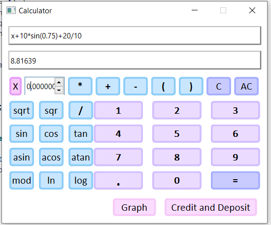
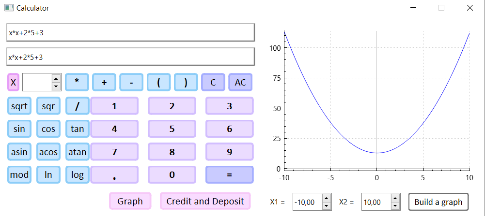
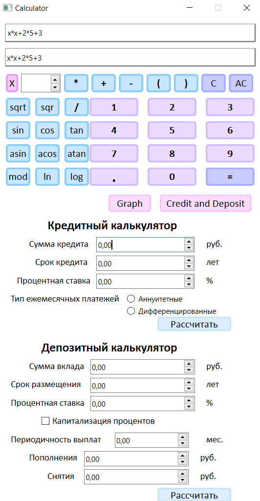

# Калькулятор на С с графическим пользовательским интерфейсом, на базе Qt

Рефлизации приложения калькулятор:

- Программа разработана на языке С стандарта C11 с использованием компилятора gcc. 
- Сборка программы  настроена с помощью Makefile со стандартным набором целей для GNU-программ: all, install, uninstall, clean, dvi, dist, test, gcov_report.
- Программа разработана в соответствии с принципами структурного программирования;
- Обеспечено покрытие unit-тестами модулей, связанных с вычислением выражений, с помощью библиотеки Check;
- Реализация с графическим пользовательским интерфейсом Qt
- На вход программы могут подаваться как целые числа, так и вещественные числа, записанные через точку. 
- Реализовано построение графика функции, заданной с помощью выражения в инфиксной нотации с переменной _x_ (с координатными осями, отметкой используемого масштаба и сеткой с адаптивным шагом);
- Область определения и область значения функций ограничиваются по крайней мере числами от -1000000 до 1000000;
- Проверяемая точность дробной части - минимум 7 знаков после запятой;
- У пользователя возможность ввода до 255 символов;
- Скобочные арифметические выражения в инфиксной нотации поддерживают следующие арифметические операции и математические функции:
    - **Арифметические операторы**:

        | Название оператора | Инфиксная нотация   (Классическая) | Префиксная нотация   (Польская нотация) |  Постфиксная нотация   (Обратная польская нотация) |
        | ------ | ------ | ------ | ------ |
        | Скобки | (a + b) | (+ a b) | a b + |
        | Сложение | a + b | + a b | a b + |
        | Вычитание | a - b | - a b | a b - |
        | Умножение | a * b | * a b | a b * |
        | Деление | a / b | / a b | a b \ |
        | Возведение в степень | a ^ b | ^ a b | a b ^ |
        | Остаток от деления | a mod b | mod a b | a b mod |
        | Унарный плюс | +a | +a | a+ |
        | Унарный минус | -a | -a | a- |

        >Обрати внимание, что оператор умножения содержит обязательный знак `*`. Обработка выражения с опущенным знаком `*` является необязательной и остается на усмотрение разработчика.

    - **Функции**:
  
        | Описание функции | Функция |   
        | ---------------- | ------- |  
        | Вычисляет косинус | cos(x) |   
        | Вычисляет синус | sin(x) |  
        | Вычисляет тангенс | tan(x) |  
        | Вычисляет арккосинус | acos(x) | 
        | Вычисляет арксинус | asin(x) | 
        | Вычисляет арктангенс | atan(x) |
        | Вычисляет квадратный корень | sqrt(x) |
        | Вычисляет натуральный логарифм | ln(x) | 
        | Вычисляет десятичный логарифм | log(x) |

## Реализован кредитный калькулятор

Специальный режим «кредитный калькулятор» (за образец взят banki.ru):
 - Вход: общая сумма кредита, срок, процентная ставка, тип (аннуитетный, дифференцированный);
 - Выход: ежемесячный платеж, переплата по кредиту, общая выплата.

## Реализован депозитный калькулятор

Специальный режим «калькулятор доходности вкладов» (за образец взят сайты banki.ru):
 - Вход: сумма вклада, срок размещения, процентная ставка, налоговая ставка, периодичность выплат, капитализация процентов, список пополнений, список частичных снятий;
 - Выход: начисленные проценты, сумма налога, сумма на вкладе к концу срока.

